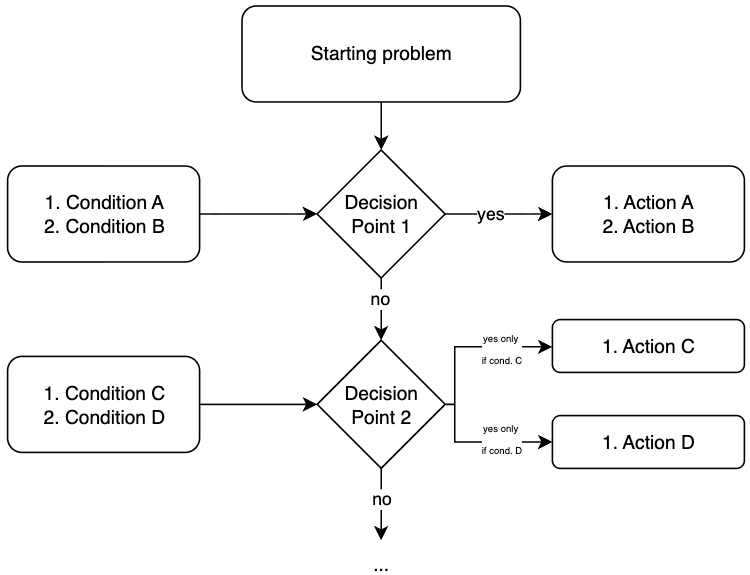
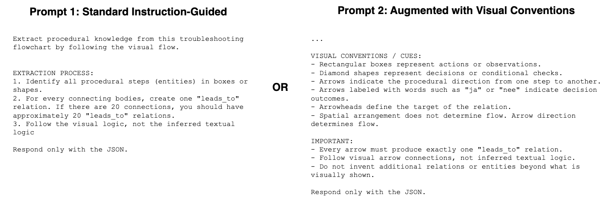

# Procedural Knowledge Extraction from Industrial Troubleshooting Guides

> **Research Context**: This repository contains the implementation for evaluating Vision Language Models (VLMs) on extracting structured procedural knowledge from industrial troubleshooting diagrams. This work is part of a paper submitted to **IFAC World Congress 2026**.

**Authors**: Guillermo Gil de Avalle, Laura Maruster, Christos Emmanouilidis (University of Groningen, The Netherlands)

Funding for the research was provided through Horizon Europe project AIXpert (ID: 101214389)

## Overview

Industrial troubleshooting guides encode diagnostic procedures in flowchart-like diagrams where spatial layout and technical language jointly convey meaning. This project evaluates two open-weight VLMs—**Pixtral-12b** and **Qwen2-VL-7b**—on extracting structured procedural knowledge from Dutch industrial maintenance guides, comparing standard instruction-guided prompts versus layout-augmented prompts.

### Key Contributions
- Evaluation framework for VLM-based procedural knowledge extraction from industrial diagrams
- Comparison of two prompting strategies: standard schema-based vs. visual convention-augmented
- Multi-tier entity matching with fuzzy text similarity and keyword-based fallback
- Analysis of model-specific trade-offs between layout sensitivity and semantic robustness

## Project Structure

```
.
├── data/
│   ├── inputs/
│   │   ├── TOCAPs/              # 12 proprietary troubleshooting guides (24 pages, Dutch)
│   │   └── hpc_results/         # HPC cluster execution results
│   ├── outputs/
│   │   ├── pixtral-12b-results/    # Pixtral model predictions
│   │   └── qwen2-vl-7b_results/    # Qwen2-VL model predictions
│   └── schemas/
│       ├── labels.yaml          # Entity/relation schema definitions
│       └── prompts.yaml         # Standard and augmented prompts
├── src/
│   ├── inference/
│   │   ├── Pixtral-12b.ipynb       # Pixtral inference notebook
│   │   └── Qwen2-VL-7B.ipynb       # Qwen2-VL inference notebook
│   └── evaluation/
│       ├── evaluation.py           # Main evaluation script with entity/relation matching
│       └── compare_prompts.py      # Prompt strategy comparison
└── requirements.txt
```

## Schema

The extraction schema aligns with the visual structure of flowchart-style troubleshooting guides and is consistent with established procedural ontologies (e.g., P-PLAN).

### Entity Types
- **Condition**: A condition or state to be verified (rectangular boxes in diagrams)
- **Action**: An operation to be performed (rectangular boxes in diagrams)
- **Decision**: A decision point with branching outcomes (diamond shapes in diagrams)

### Relation Type
- **isPreceededBy**: One step is preceded by another in the procedure (arrows in diagrams)

## Dataset

- **Source**: 12 proprietary industrial troubleshooting guides (Dutch language)
- **Format**: Flowchart-like diagrams with shapes, arrows, and branch labels ("ja"/"nee")
- **Size**: 24 pages total, ~30-100 entities and ~30-60 relations per document
- **Gold Standard**: 548 manually annotated entities and 536 relations by domain experts

### Example Troubleshooting Guide Structure



*Figure: Example of troubleshooting guide structure showing rectangular boxes for conditions/actions, diamond shapes for decision points, and arrows indicating procedural flow with "ja"/"nee" branch labels.*

## Models Evaluated

### Vision Language Models
- **Pixtral-12b** ([mistralai/Pixtral-12B-2409](https://huggingface.co/mistralai/Pixtral-12B-2409))
- **Qwen2-VL-7b** ([Qwen/Qwen2-VL-7B-Instruct](https://huggingface.co/Qwen/Qwen2-VL-7B-Instruct))

### Prompting Strategies
1. **Standard Prompt**: Schema outline + JSON example
2. **Augmented Prompt**: Standard + explicit visual convention descriptions (shape roles, arrow interpretation, branch labels)



*Figure: Comparison of standard instruction-guided prompt versus augmented prompt with visual convention descriptions.*

## Installation

```bash
# Clone repository
git clone <repository-url>
cd Procedural-Knowledge-Graphs-Extraction-from-Industrial-Maintenance-Troubleshooting-Guides

# Install dependencies
pip install -r requirements.txt

# Install Dutch spaCy model (for text normalization)
python -m spacy download nl_core_news_sm
```

## Usage

### Running Inference

Inference is performed via Jupyter notebooks for each model:

```bash
# Pixtral-12b
jupyter notebook src/inference/Pixtral-12b.ipynb

# Qwen2-VL-7b
jupyter notebook src/inference/Qwen2-VL-7B.ipynb
```

Models process each page independently and output structured JSON with entities and relations.

### Running Evaluation

Evaluate model outputs against ground truth:

```bash
cd src/evaluation

# Evaluate a single model
python evaluation.py \
  --model_output ../../data/outputs/pixtral-12b-results \
  --ground_truth ../../data/inputs/TOCAPs \
  --output results_pixtral.json \
  --model_name "Pixtral-12b"

# Compare prompting strategies
python compare_prompts.py \
  --enhanced ../../data/outputs/pixtral-12b-results/enhanced \
  --standard ../../data/outputs/pixtral-12b-results/standard \
  --ground_truth ../../data/inputs/TOCAPs \
  --output_dir ../../data/outputs/comparison
```

### Running on HPC

The models were executed on an HPC cluster with the following hardware:
- **GPU**: Nvidia A100 (40GB VRAM)
- **Memory**: 40GB RAM
- **Compute Time**: Up to 24 hours per model

```bash
#!/bin/bash
#SBATCH --job-name=vlm_extraction
#SBATCH --partition=gpu
#SBATCH --gres=gpu:a100:1
#SBATCH --mem=40G
#SBATCH --time=24:00:00

module load Python/3.10.4-GCCcore-11.3.0
source venv/bin/activate

# Run inference notebook
jupyter nbconvert --to notebook --execute src/inference/Pixtral-12b.ipynb
```


## Output Format

### Model Predictions
```json
{
  "entities": [
    {
      "id": "E1",
      "type": "Condition",
      "text": "Check water pressure"
    }
  ],
  "relations": [
    {
      "source": "E1",
      "target": "E2",
      "type": "isPreceededBy"
    }
  ]
}
```

### Evaluation Results
```json
{
  "model_name": "Pixtral-12b",
  "results": {
    "0.9": {
      "aggregate": {
        "entities": {"precision": 0.85, "recall": 0.78, "f1": 0.81},
        "relations": {"precision": 0.72, "recall": 0.65, "f1": 0.68}
      }
    }
  }
}
```

## Citation

If you use this code or methodology, please cite:

```bibtex
@inproceedings{gil2026procedural,
  title={Procedural Knowledge Extraction from Industrial Troubleshooting Guides Using Vision Language Models},
  author={Gil de Avalle, Guillermo and Maruster, Laura and Emmanouilidis, Christos},
  booktitle={IFAC World Congress 2026},
  year={2026},
  note={Funded by Horizon Europe project AIXpert (ID: 101214389)}
}
```

## License

MIT License - see LICENSE file for details.
